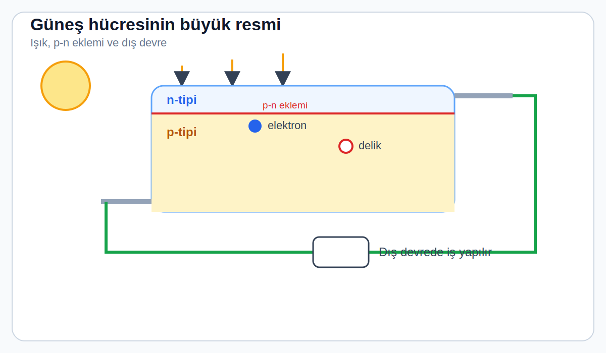
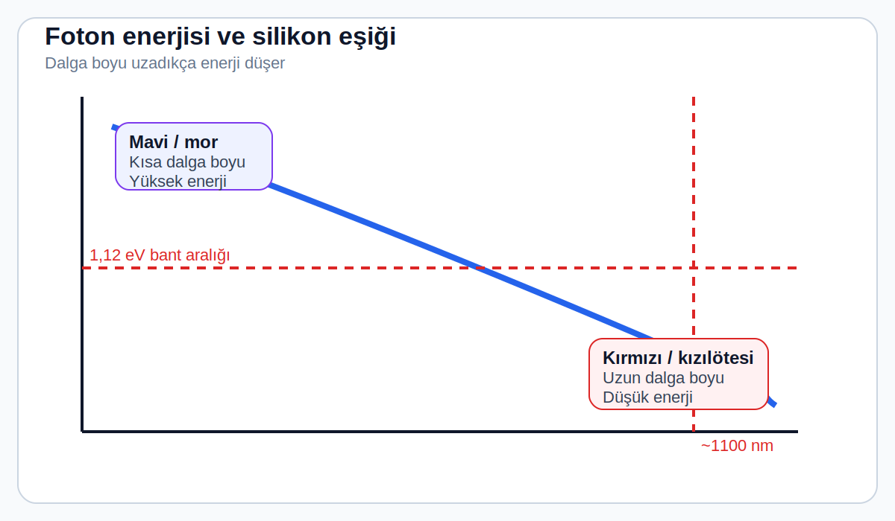
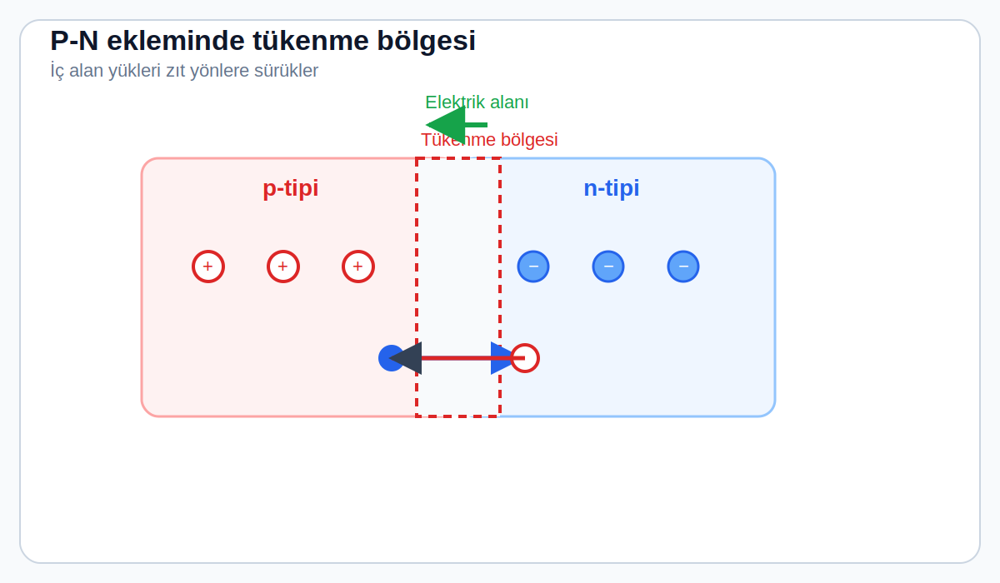
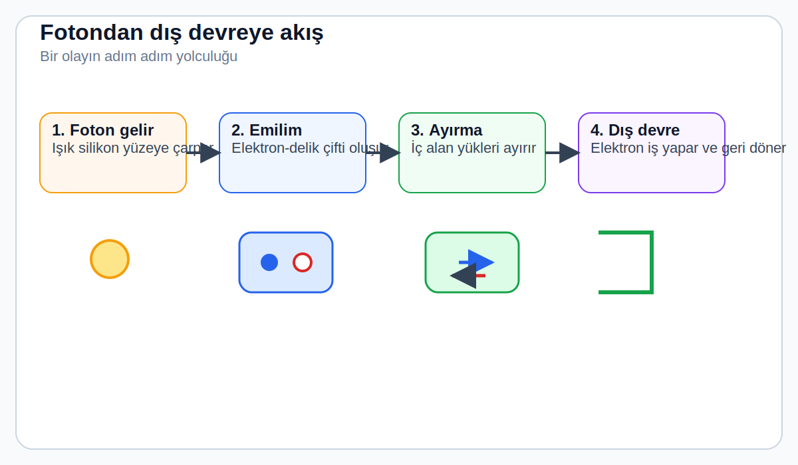

# 1. Gün: Güneş Hücresi Aslında Nedir?

---

## Fark Etmeden Kanıksadığımız Bir Mucize

Tam şu anda, dünyanın bir köşesinde, 8 dakika 20 saniye önce Güneş'in yüzeyinden kopmuş bir foton ince bir silikon tabakaya çarpıyor. Bu darbe bir elektronu yerinden koparıyor. O elektron bir metal iletkenin içine sürükleniyor, trilyonlarca benzeriyle birleşiyor — ve ortaya bir akım çıkıyor: bir telefonu şarj eden, bir fabrikayı çalıştıran, bir evin ışığını açık tutan akım.

Yanma yok. Çark yok. Hiçbir hareketli parça yok. Işık giriyor, elektrik çıkıyor. Hepsi bu.

> 💡 **Foton nedir?**
> Işığın en küçük "paketçiği." Güneş ışığı aslında bu paketlerden oluşan bir seldir. Her foton belirli bir miktar enerji taşır — rengi ne kadar maviye yakınsa enerjisi o kadar yüksek.

Buna **fotovoltaik etki** diyoruz. Güneş hücresi kömür santrali gibi enerji *üretmez* — enerjiyi bir biçimden diğerine *dönüştürür*. Işıktan doğrudan elektriğe, tek bir kuantum-mekanik adımda. Arada ısıya gerek yok, buhara gerek yok, dönen türbine gerek yok. Bu sadelik, fizikteki en zarif enerji dönüşümlerinden birini oluşturuyor.

> 🧭 **Bugünün zihinsel modeli:**
> Bu dersi okurken güneş hücresini üç parçalı bir düzenek gibi düşünün: **ışığı emen malzeme**, **yükleri ayıran iç elektrik alanı**, **elektronları dış devreye taşıyan metal kontaklar**. Kalan ayrıntılar bu üç parçanın etrafında kuruluyor.

*Şekil önerisi: Hücrenin üstten ve yandan basit görünümü; ışığın gelişi, p-n eklemi ve dış devre etiketlenir.*

Ama çoğumuza sorsanız, "güneş paneli nasıl çalışır?" sorusuna verecek net bir yanıtımız yoktur. Bugün tam da bunu çözeceğiz — el sallamayla değil, komşunuzun çatısındaki o koyu mavi levhanın içinde gerçekte ne olduğunu anlayacak düzeyde.

---

## Fotonlar: Küçük Enerji Paketleri

Güneş ışığının kendisiyle başlayalım. Güneş'in yüzey sıcaklığı yaklaşık 5.500°C. Bu sıcaklıktaki her nesne gibi enerji yayar ve bu enerji bize **foton** denilen küçük paketler halinde ulaşır.

Her fotonun enerjisi, dalga boyuna göre belirlenir:

- **Kısa dalga boyu** (mavi, mor) → yüksek enerji
- **Uzun dalga boyu** (kırmızı, kızılötesi) → düşük enerji

Formülü merak edenler için: **E = hf**, burada *h* Planck sabiti, *f* ise frekans. Ama formülü ezberlemek değil, sezgiyi kavramak önemli: mavi ışık daha enerjik, kırmızı ışık daha az enerjik.

Birkaç örnek:

| Işık türü | Dalga boyu | Enerji |
|-----------|-----------|--------|
| Kırmızı ışık | 700 nm | 1,77 eV |
| Mavi ışık | 450 nm | 2,76 eV |
| Kızılötesi | 1100 nm | 1,13 eV |

> 💡 **eV (elektron-volt) nedir?**
> Çok küçük enerji birimidir. Atom dünyasında joule gibi büyük birimler kullanışsızdır — bu yüzden fizikçiler eV kullanır. Bir eV, bir elektronu bir voltluk potansiyel farkıyla hızlandırmak için gereken enerjidir.

Bu özel sayılar neden önemli? Çünkü **silikon** — güneş panellerinin %95'inde kullanılan malzeme — 1,12 eV'lık bir **bant aralığına** sahip. Bu tek sayı, güneş enerjisi endüstrisinin var olma sebebidir.

*Şekil önerisi: Kısa dalga boyunda daha yüksek enerji, 1,12 eV eşiği ve 1100 nm civarında kesim.*

---

## Bant Aralığı: Doğanın Kapıdaki Fedaisi

Şimdi kilit kavrama geliyoruz. Bant aralığını anlamak için, elektronların bir kristalde ne yaptığını bilmemiz gerekiyor.

Silikon kristalinde her atom dört komşuya bağlıdır ve elektronlarını kovalent bağlarla paylaşır. Bu bağlardaki elektronlar yerlerine sıkışmıştır — fizikçiler buna **valans bandı** der. Valans bandındaki bir elektron kristali bir arada tutar ama elektriği iletmek için hiçbir işe yaramaz.

Bunun üstünde **iletim bandı** var — elektronların serbestçe dolaşarak akım taşıyabildiği enerji aralığı.

İki bant arasındaki boşluk ise **bant aralığı**: Hiçbir elektronun var olamayacağı yasak bölge. Silikonda bu boşluk **1,12 eV** genişliğindedir.

> 🎯 **Basit bir benzetme:**
> Bant aralığını gece kulübünün giriş ücreti gibi düşünün. Foton en az 1,12 eV taşıyorsa "giriş bedelini" ödeyebilir ve bir elektronu valans bandından iletim bandına yükseltir. Elektron artık serbesttir ve akım taşıyabilir. Fotonun enerjisi 1,12 eV'den azsa? Geri çevrilir — silikon onu görmezden gelir.

Bu yüzden silikon 1100 nm'nin ötesindeki kızılötesi ışığa karşı neredeyse şeffaftır — o fotonların enerjisi bant aralığını aşmaya yetmez, öylece geçip giderler.

> 💡 **İlk kez okuyorsanız şunu hatırlayın:**
> Güneş hücresi tüm ışığı kullanmaz. Bazı fotonlar **çok zayıf** olduğu için hiçbir şey yapamaz; bazıları ise **gereğinden fazla enerjik** olduğu için fazlalığı ısı olarak kaybeder. Verimlilik meselesinin kalbi burada başlar.

Ama işin ters köşesi: 1,12 eV'den *fazla* enerji taşıyan fotonlar da enerjinin bir kısmını boşa harcar. 2,76 eV'lik mavi bir foton elektronu bant aralığının ötesine geçirir, ama fazla olan 1,64 eV elektriğe dönüşmez — ısı olarak kaybolur. Buna **termalizasyon kaybı** denir ve güneş hücrelerinin ışığın tamamını elektriğe çevirememesinin en büyük nedenidir.

> ⚡ **Neden bu kadar önemli?**
> Daha bir şey inşa etmeden fizik zaten verimlilik tavanımızı belirlemiş durumda. Çok kırmızı fotonlar hiç işe yaramaz. Çok mavi fotonlar enerjilerinin bir kısmını çöpe atar. Bu temel sınıra **Shockley-Queisser limiti** denir ve tek eklemli bir silikon hücreyi en fazla %33,7 verimlilikle sınırlar. 12. Günde detaylıca inceleyeceğiz.

---

## Delik: Düşen Her Elektrona Bir Boşluk

Foton bir elektronu iletim bandına fırlattığında, geride bir boşluk kalır — buna **delik** diyoruz. Delik pozitif yük taşıyıcısı gibi davranır: Komşu elektronlar bu boşluğa atlayabilir ve böylece boşluk ters yönde "hareket eder."

Artık iki yük taşıyıcımız var:
- **Serbest elektron** (negatif)
- **Delik** (pozitif)

Bu ikisine birden **elektron-delik çifti** denir. Oluşturmak kolay kısım — zor olan, bunları yeniden birleşmeden *ayırmak*. Kendi hallerine bırakılırsa elektron mikrosaniyeler içinde deliğe geri düşer ve enerjisini ısı olarak kaybeder.

> 💡 **Eğlenceli bilgi:** LED'ler de tam olarak bu prensipte çalışır — ama tam tersine! Elektron deliğe düşer ve ışık yayar. Güneş hücresi LED'in ayna görüntüsüdür.

Peki bu yeniden birleşmeyi nasıl önleyeceğiz? Yükler için tek yönlü bir kapı inşa ederek. O kapının adı: **p-n eklemi**.

---

## P-N Eklemi: Hücrenin Gizli Silahı

Saf silikon çok kötü bir iletkendir — santimetre küpünde yalnızca 1,5 × 10¹⁰ serbest taşıyıcı var. Bakırda bu sayı 8,5 × 10²²'dir — arada on iki büyüklük sırası fark var. Silikonu işe yarar hale getirmek için onu **doplayarız**, yani kasıtlı olarak belirli yabancı maddelerle "kirletiriz."

> 💡 **Doplama (Doping) nedir?**
> Saf silikona kontrollü miktarda yabancı atom ekleyerek elektriksel özelliklerini değiştirme işlemidir. Silikonun dört dış elektronu var. Beş elektronlu bir atom (fosfor) eklerseniz, fazla elektron serbest kalır → **n-tipi silikon**. Üç elektronlu bir atom (bor) eklerseniz, bir boşluk oluşur → **p-tipi silikon**.

Şimdi sihirli adım: p-tipi bir silikon tabakasının üzerine ince bir n-tipi katman koyun. Sınırda — yani **p-n ekleminde** — kendiliğinden olağanüstü bir olay gerçekleşir:

1. N tarafının fazla elektronları p tarafına yayılır, p tarafının delikleri n tarafına yayılır.
2. Bu yayılma, sınırdaki mobil taşıyıcıları silerek geride sabit iyonlar bırakır.
3. Sabit iyonlar, n'den p'ye doğru bir **elektrik alanı** oluşturur.

Bu alana sahip ince bölgeye **tükenme bölgesi** denir (tipik olarak 0,1–1 mikrometre genişliğinde). Bu alan, güneş hücresinin gizli silahıdır: kalıcı, bakım gerektirmeyen bir yük ayırıcı. Bölge yakınında oluşan her elektron-delik çifti anında parçalanır — elektron n tarafına, delik p tarafına itilir.

> 🎯 **Buradaki kritik fikir:**
> Güneş hücresi elektronu yalnızca *oluşturmaz*; onu doğru yöne *zorlar*. Eğer bu iç elektrik alan olmasaydı, oluşan yüklerin büyük kısmı yeniden birleşip kaybolurdu.

*Şekil önerisi: Sabit iyonlar, alan yönü ve elektron/deliklerin itildiği taraflar gösterilir.*

> 🎯 **Kritik sayı:** Silikonda bu eklemin yerleşik gerilimi yaklaşık 0,6–0,7 volt. Bu nedenle tek bir güneş hücresi yük altında 0,5–0,6 volt üretir. Panelinize 20 volt istiyorsanız, yaklaşık 36 hücreyi seri bağlarsınız — üreticilerin yaptığı da tam olarak budur.

---

## Fotondan Devreye: Yolculuğun Tamamı

Her şeyi bir araya koyalım. Bir fotonun güneş hücresine girip elektriğe dönüşmesinin adım adım öyküsü:

1. **Foton hücreye girer** — örneğin 620 nm'de turuncu bir foton (2,0 eV enerji).

2. **Silikona nüfuz eder** — mavi ışık ilk 1–2 μm'de emilir, kırmızı ışık 10+ μm'ye iner, kızılötesi 100+ μm'ye gider.

3. **Bir silikon atomu fotonu emer** ve enerjisini bir elektrona aktarır. Elektron iletim bandına çıkar, geride bir delik kalır. Fazla enerji (2,0 – 1,12 = 0,88 eV) ısıya dönüşür.

4. **Elektron ve delik kristalde rastgele dolaşır.** Eğer p-n eklemine yeterince yakınlarsa (iyi silikonda 100–300 μm), yeniden birleşmeden tükenme bölgesine ulaşma şansları yüksektir.

5. **Dahili alan onları yakalar:** elektron n tarafına, delik p tarafına.

6. **Elektron üst metal kontaktan çıkar** (güneş hücrelerindeki o ince gümüş çizgiler), dış devre boyunca akar, yaptığı işi yapar ve alt kontaktan geri dönerek bir delikle birleşir. Döngü tamamlanır.

Tüm süreç yaklaşık bir mikrosaniye sürer. Güneşli bir günde tipik bir panelde bu olay saniyede yaklaşık **10²¹ kez** tekrarlanır — yani saniyede bir *sekstilyon* elektron-delik çifti — ve kabaca 300–400 watt güç üretir.

*Şekil önerisi: Fotonun gelişi, emilim, yük ayrımı, elektronun dış devrede akması ve geri dönüşü tek akışta gösterilir.*

---

## Neden Göründüğü Kadar Kolay Değil?

Fizik zarif, ama gerçek dünyada iyi bir güneş hücresi yapmak her adımda kayıplarla boğuşmak demek:

**🔲 Optik kayıplar:** Çıplak silikon gelen ışığın yaklaşık %30'unu geri yansıtır — neredeyse ayna gibi parlak bir yüzeyi var. O yüzden gerçek hücreler yansıma önleyici kaplamalara ve dokulu yüzeylere sahip (7. Gün). Hücrelerin koyu mavi veya siyah olmasının sebebi de budur — o renk, kaplamanın işini yaptığının kanıtıdır.

**♻️ Rekombinasyon kayıpları:** P-n eklemine ulaşamadan birleşen her elektron-delik çifti boşa gider. Rekombinasyon kristal kusurlarında, tane sınırlarında ve özellikle yüzeylerde olur. 1954'te Bell Labs'deki ilk %6 verimli hücreden günümüzün %26,8'lik rekoruna (LONGi, 2024) kadar güneş hücresi gelişiminin tarihi, büyük ölçüde rekombinasyonu azaltma hikâyesidir.

**🔥 Direnç kayıpları:** Silikonda ve metal kontaklarda akan akım ısı üretir (I²R). Kontakları çok ince yaparsanız direnç artar. Çok kalın yaparsanız gelen ışığı engellerler. Bu, gerçek bir mühendislik ödünleşmesidir.

**🌈 Spektral uyumsuzluk:** Dediğimiz gibi, 1,12 eV'nin altındaki fotonlar işe yaramaz, üstündekiler ise fazla enerjilerini çöpe atar. Bu iki etki, herhangi bir mühendislik kusuruna girmeden önce tek başına gelen güneş enerjisinin %50'sinden fazlasını yok eder.

> 📈 **Bugünkü durum:**
> LONGi, JinkoSolar veya Trina Solar gibi firmaların üretim hatlarından çıkan modern hücreler, gelen güneş ışığının yaklaşık **%22–24'ünü** elektriğe çevirir. En iyi laboratuvar hücreleri %27'ye ulaşıyor. Tek eklemli silikon için teorik maksimum %29,4 — ve biz bu tavanın %91'indeyiz. Fazla alan kalmadı.

---

## Güneş Hücreleri Hakkında Şaşırtıcı Gerçek

Beklentilerin tersine: **güneş hücreleri sıcakta daha kötü çalışır.**

"Daha çok güneş = daha çok ısı = daha çok enerji" diye düşünebilirsiniz, ama silikonun bant aralığı sıcaklık arttıkça *daralır* (25°C'de 1,12 eV → 75°C'de ~1,08 eV). Bu daha fazla fotonu geçirmeli gibi görünür, ama voltaj düşüşü akım kazancını aşar. Sonuç: Silikon güneş hücreleri, 25°C üzerindeki her derece için gücün yaklaşık **%0,3–0,5'ini** kaybeder.

45°C'lik bir çatıda bu, **%6–10'luk** bir performans düşüşü demek.

> 🌡️ **Pratik sonuç:** Serin ama güneşli iklimler (yüksek rakımlı çöller, bahar günleri) beklentilerin üstünde performans verir. Phoenix'teki siyah çatılar ise beklentilerin altında kalır. Bazı yeni nesil hücrelerin (HJT gibi) düşük sıcaklık katsayılarıyla övünmesinin sebebi de budur — 9. Gün'de anlatacağız.

---

## Somut Sayılar

Bugünün standart silikon güneş hücresi:

| Özellik | Değer |
|---------|-------|
| Boyut | 182 × 182 mm (M10) veya 210 × 210 mm (G12) |
| Kalınlık | 150–180 μm (insan saçının ~2 katı) |
| Gerilim | ~0,5 V |
| Akım | 10–12 A |
| Güç (hücre başına) | ~5–6 W |
| Tipik panel (72 hücre) | 400–580 W |

Küresel güneş enerjisi endüstrisi 2025'te yaklaşık **600 GW** güneş paneli üretti — hepsi aynı anda çalışsa, yaklaşık 100 milyon Amerikan evine yetecek kadar. On yıl önce yıllık üretim 50 GW'tı — bu büyüme, o dönemde hayal bile edilemezdi.

Ve bu wattların her biri aynı şekilde başlar: 8 dakikalık bir ışın yolculuğundan gelen bir foton, bir silikon kristalindeki 1,12 eV bant aralığı boyunca tek bir elektronu tekmeliyor. Gerisi mühendislik.

---

## Yarına Hazırlık

Artık bir güneş hücresinin ne yaptığını anladığınıza göre, sıradaki soru belli: **Silikon nereden geliyor?** Cevap, akla gelebilecek en sıradan yerde başlıyor — bir kum yığınında — ve dünyanın en enerji yoğun endüstriyel süreçlerinden birinde bitiyor.

Yarın, silikonun sahil kumundan yarı iletken malzemeye dönüşüm yolculuğunu izleyeceğiz. Ve "kumdan yapılıyor" ifadesinin işin zorluğunu ne kadar hafife aldığını göreceksiniz.

*2. Gün'de görüşürüz.* ⚡

---

## 🧪 Anlayışınızı Test Edin

{{#quiz quizzes/day-01.toml}}
