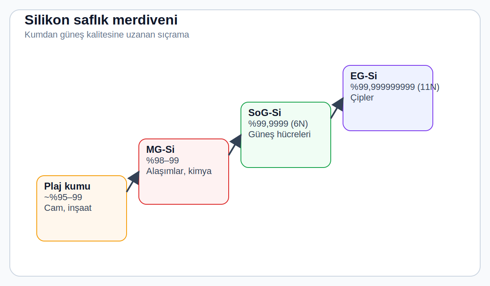
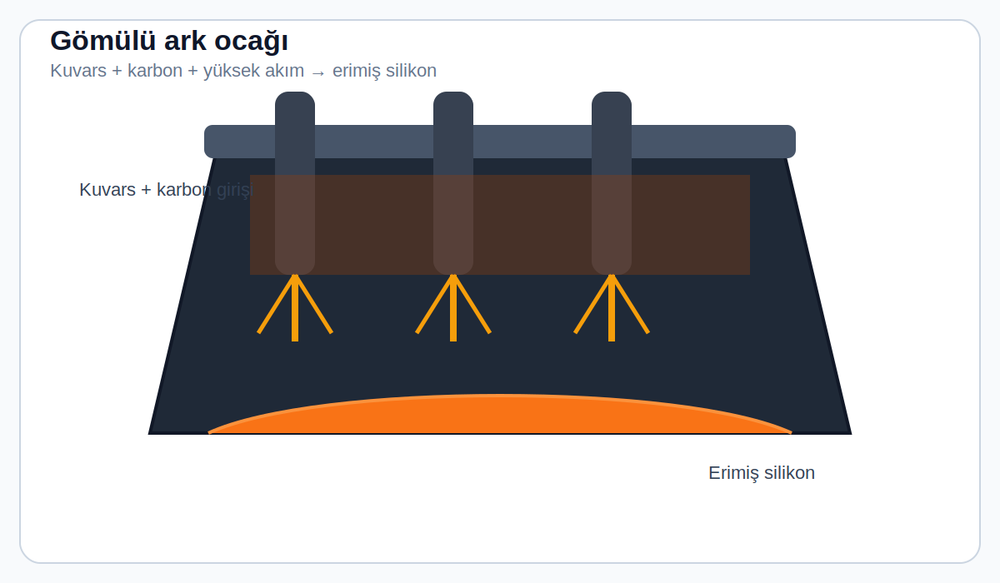
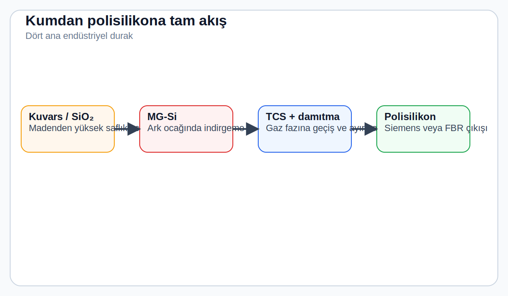
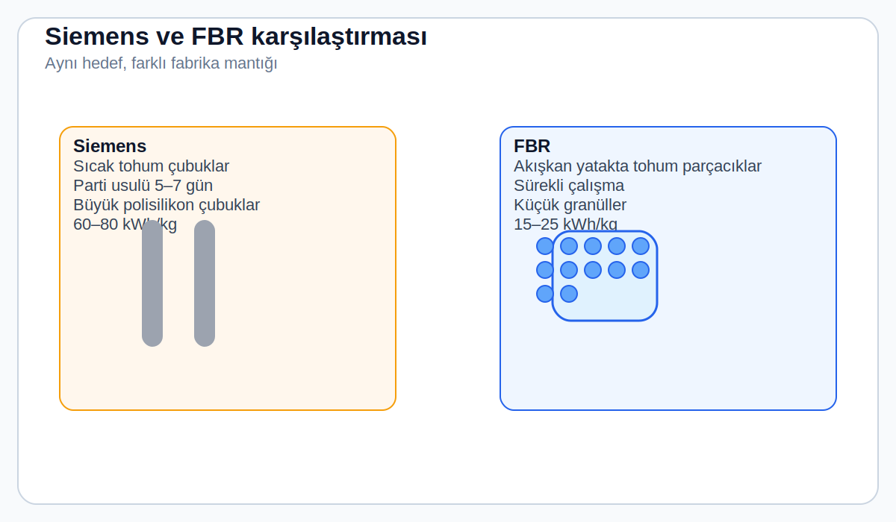

# 2. Gün: Silikon — Kumdan Yarı İletkene

*Yer kabuğunun en bol ikinci elementi, modern dünyayı iki kez inşa etti: önce camla, sonra çiplerle. Şimdi üçüncü kez, güneş panelleriyle yapıyor. Ama sahildeki bir kum tanesini elektrik üreten malzemeye dönüştürmek, endüstriyel kimyanın en zorlu saflaştırma yolculuklarından birini gerektiriyor.*

---

## Bol Ama Yetersiz

Hangi kumsala, hangi çöle, hangi dağa bakarsanız bakın — silikona bakıyorsunuz. Yer kabuğunun ağırlıkça %27,7'sini oluşturur: oksijenden sonra ikinci sırada, alüminyum ve demirin önünde. Kuvars minerali (SiO₂) o kadar yaygındır ki jeolojide "arka plan sesi" gibidir.

Ama o zaman neden güneş enerjisi için silikon ucuz değil?

Ucuz olan silikonun *kendisi.* Pahalı olan, silikon *olmayan* her şeyi çıkarmak.

> 🧭 **Bugünün özeti tek cümlede:**
> Silikon bol olduğu için değil, **yeterince saf hale getirilebildiği** için güneş paneli malzemesi olarak işe yarar.

> ⚡ **Mantığa aykırı gerçek:**
> Hammadde neredeyse bedava, ama onu kullanılabilir hale getirmek dünyadaki en enerji yoğun süreçlerden biri. Bir kilogram güneş enerjisi kalitesinde polisilikon üretmek **60–80 kWh** elektrik gerektirir. Bu, her güneş panelinin bir "enerji borcu" ile doğduğu anlamına gelir — ama bu borç 1–2 yılda ödenir, ardından panel 25+ yıl daha temiz enerji üretir.

---

## Saflık Merdiveni

Tırmanmamız gereken yol şöyle görünüyor:

| Sınıf | Saflık | Ne İçin Kullanılır |
|-------|--------|-------------------|
| Plaj kumu | ~%95–99 Si (SiO₂ olarak) | Cam, inşaat |
| Metalürjik kalite (MG-Si) | %98–99 | Alaşımlar, silikon polimerleri |
| **Güneş enerjisi kalitesi (SoG-Si)** | **%99,9999 (6N)** | **Güneş hücreleri** |
| Elektronik kalite (EG-Si) | %99,999999999 (11N) | Bilgisayar çipleri |

> 💡 **"Altı dokuz" ne demek?**
> %99,9999 saflıkta altı tane dokuz var. Bunu bir milyon kişilik stadyum gibi düşünün: yabancı madde olarak yalnızca *tek bir* kişi var. Elektronik kalite için milyar kişilik bir stadyumda sadece bir kişi yabancı olabilir.

%99'dan %99,9999'a sıçramak, dört büyüklük sırası iyileşme demek. Bu, tüm endüstriyi tanımlayan zorluğun ta kendisi.

*Şekil önerisi: Dört kalite seviyesi soldan sağa veya aşağıdan yukarıya karşılaştırılır.*

---

## Birinci Adım: Oksijeni Koparma

Silikon doğada serbest halde bulunmaz — daima oksijene bağlıdır. Si–O bağı kimyadaki en güçlü bağlardan biridir (~452 kJ/mol). Bu bağı kırmak, silikon üretiminin ilk ve en şiddetli adımıdır.

Bu iş **gömülü ark ocağında** yapılır: 10–15 metre çapında devasa bir endüstriyel fırın. İçine kuvarsit (yüksek saflıkta SiO₂ cevheri) ve karbon kaynakları (kömür, odun kömürü) yüklenir. Üç büyük grafit elektrot karışıma daldırılır ve 100.000+ amperlik akım geçirilir.

*Şekil önerisi: Kuvars + karbon girişi, elektrotlar, yüksek sıcaklık bölgesi ve altta toplanan erimiş silikon.*

Fırındaki sıcaklık 2.000°C'ye ulaşır. Bu sıcaklıkta karbon, oksijeni silikondan koparır:

**SiO₂ + 2C → Si + 2CO ↑**

> 🎯 **Düz çeviri:** "Kum + kömür → silikon + karbon monoksit gazı." Karbon monoksit uçar, erimiş silikon fırının dibinde birikir.

Ortaya çıkan **metalürjik kalite silikon** (MG-Si) yaklaşık %98–99 saftır. Parlak turuncu-beyaz renkte erimiş halde birikir ve ton başına 11–13 MWh elektrik tüketir. Bu yüzden silikon izabe tesisleri ucuz hidroelektrik santrallerinin yanına kurulur: Norveç, Brezilya ve Çin'in Yünnan/Siçuan bölgeleri.

> 🌍 **Kim üretiyor?**
> Dünya MG-Si'nin %80'inden fazlasını Çin üretir. Yıllık toplam üretim 3,5–4 milyon ton. Bunun büyük kısmı güneş paneli görmez — alüminyum alaşımları, silikon polimerleri ve kimyasallar için kullanılır. Yalnızca %15–20'si güneş ve yarı iletken endüstrisine gider.

---

## Saflık Neden Bu Kadar Önemli?

"Yüzde 99 saf" kulağa yeterli geliyor, değil mi? Değil. Çünkü güneş hücreleri yarı iletken cihazlardır ve yarı iletkenler yabancı maddelere karşı inanılmaz hassastır.

1\. Gün'den hatırlayın: güneş hücresi, p-n eklemindeki elektrik alanı sayesinde çalışır. Bu eklem, milyonda bir oranında kontrollü katkılama gerektirir. Eğer "kontrol dışı" yabancı maddeler zaten milyonda bir seviyesindeyse, başlamadan oyunu kaybetmişsiniz demektir.

Birkaç somut örnek:

> 💡 **Buradaki sezgi önemli:**
> Güneş hücresi için sorun yalnızca "kirli malzeme" değildir; sorun, yanlış atomların elektronların yoluna tuzak koymasıdır. Yani kimyasal temizlik doğrudan elektrik performansına dönüşür.

| Safsızlık | Etkisi |
|-----------|--------|
| **Demir** | Milyarda 1 atom bile güneş hücresi verimini yarı yarıya düşürebilir — rekombinasyon merkezi oluşturur |
| **Bakır** | Aynı sorun, üstelik silikonda çok hızlı yayılır |
| **Karbon** | Yüksek dozda silisyum karbür çökeltileri oluşturur — mekanik ve elektriksel ölü bölgeler yaratır |
| **Oksijen** | Az miktarda zararsız, hatta faydalı — ama çok fazla olunca elektriksel özellikleri bozar |

> ⚡ **Özet:** Saflaştırma soyut bir standart yüzünden yapılmıyor — fizik gerektirdiği için yapılıyor. Her başıboş demir atomu, fotojenere elektronlar için küçük bir suikastçı.

---

## İkinci Adım: Silikonu Gaza Dönüştür, Gazı Saflaştır, Geri Katılaştır

Erimiş metalden tek tek atomları seçemezsiniz. Bu yüzden silikon endüstrisi dahiyane bir numara kullanır: **katı silikonu gaza dönüştürür, gazı damıtarak saflaştırır, sonra geri katı hale getirir.**

MG-Si, 300–350°C'de hidroklorik asit (HCl) gazıyla tepkimeye sokulur:

**Si + 3HCl → SiHCl₃ + H₂**

Ürün **triklorosilan (TCS)**: Yalnızca 31,8°C'de kaynayan berrak bir sıvı. Sıvı olduğu için **damıtılabilir** — ham petrolü benzin, dizel ve gazyağına ayırmak için kullanılan aynı temel teknik.

> 💡 **Neden gaza dönüştürme işe yarıyor?**
> Demir, alüminyum, bor ve fosfor gibi safsızlıkların klorosilan bileşikleri çok farklı kaynama noktalarına sahiptir. Bu fark, standart damıtma kuleleriyle son derece etkili bir ayırma sağlar — trilyon başına parça düzeyine kadar.

Saflaştırılmış TCS daha sonra **Siemens işlemiyle** (3. Gün'ün konusu) yaklaşık 1.100°C'de sıcak silikon çubukların üzerinden geçirilerek tekrar katı silikona ayrıştırılır:

**2SiHCl₃ + 2H₂ → 2Si + 6HCl**

Sonuç: Eritmeye ve kristal büyütmeye hazır, 6N ila 9N saflıkta **polisilikon** — kalın, gümüşi gri çubuklar.

*Şekil önerisi: Kuvars → MG-Si → TCS → damıtma → Siemens/FBR → polisilikon akışı tek şemada.*

---

## Alternatif Yol: Akışkan Yataklı Reaktörler (FBR)

Siemens işlemi mükemmel çalışır ama yavaştır ve çok elektrik yer. Bunun alternatifi **akışkan yataklı reaktör (FBR)**:

| | Siemens | FBR |
|---|---------|-----|
| **Enerji tüketimi** | 60–80 kWh/kg | 15–25 kWh/kg |
| **Çalışma şekli** | Parti (5–7 gün) | Sürekli |
| **Ürün formu** | Büyük çubuklar | Küçük granüller (~1–3 mm) |

FBR'de silan gazı (SiH₄), küçük silikon tohum parçacıklarının üzerinden yukarı doğru akar. Gaz parçalanarak tohumların üzerine silikon biriktirir — kartopunun büyümesi gibi. Enerji tasarrufu %60–75'e ulaşır.

> 🎯 **Neden bu karşılaştırma önemli?**
> Aynı hedefe — ultra saf silikona — farklı fabrika tasarımlarıyla ulaşabilirsiniz. Güneş sektöründe maliyet düşüşünün büyük kısmı, tam da bu tür süreç farklarından gelir.

*Şekil önerisi: Solda çubuk büyüten Siemens, sağda granül üreten FBR; enerji tüketimi de etiketlenir.*

GCL Technology (Çin) bu alanda lider: 2024'te yıllık 300.000+ ton kapasiteyle granüler polisilikon üretiyordu. Dezavantajı? Granüller daha yüksek yüzey kirliliğine ve hidrojen içeriğine sahip olabiliyor — ama bu sorunlar giderek çözülüyor.

---

## Neden Başka Bir Malzeme Değil de Silikon?

Yüzlerce yarı iletken var. Galyum arsenit güneş ışığını daha iyi dönüştürür. Kadmiyum tellürür ince film olarak daha ucuz biriktirilir. Perovskitler mürekkep gibi basılabilir. Silikon neden pazarın %95'inden fazlasını kontrol ediyor?

Altı faktörün bileşimi:

| Faktör | Açıklama |
|--------|----------|
| **Bolluk** | Silikon tükenmez. Tellür altından daha nadir, indiyum çinko madenciliğinin yan ürünü. |
| **Bant aralığı** | 1,12 eV — optimum ~1,34 eV'ye oldukça yakın. Kozmik bir tesadüf. |
| **Kararlılık** | 1985'te kurulan bir hücre bugün hâlâ çalışıyor. Silikon havada paslanmaz, güneşte bozunmaz. |
| **Altyapı** | 60 yıllık yarı iletken sanayisi: ekipman, kimyasal tedarikçiler, mühendisler… Hepsi silikon için optimize. |
| **Öğrenme eğrisi** | 1976'dan bu yana fiyat %99,6 düştü (~106→<0,20 $/W). Rakipler sürekli düşen bir hedefi kovalıyor. |
| **Güvenlik** | Silikon biyolojik olarak inert — yiyebilirsiniz (zaten yulaf ve pirinçte var). Kadmiyum bilinen bir kanserojen. |

> 💡 **Swanson Yasası:** Kümülatif silikon paneli üretimi her iki katına çıktığında, fiyatlar yaklaşık %24 düşer. Bu, 50 yıldır tutarlı bir şekilde geçerli olan inanılmaz bir ölçek etkisi.

---

## Endüstrinin Ölçeği

2024'te küresel polisilikon üretim kapasitesi yılda **2,5 milyon tonu** aştı. Çinli üreticiler (Tongwei, GCL Technology, Daqo, Xinte, East Hope) bunun %95'ini kontrol ediyor. Tongwei'nin Leshan, Sichuan'daki fabrikası tek başına yılda 200.000+ ton üretiyor.

Bu fabrikalar yılın 365 günü, günün 24 saati çalışıyor. Tek bir büyük Siemens reaktörü, bir haftalık döngüde 36 çift silikon çubuk barındırabilir ve parti başına 8–10 ton polisilikon üretir.

Bütün bu devasa altyapı tek bir soruyu yanıtlamak için var: *Dünyanın en yaygın maddelerinden birini, tek tek fotonları hissedebilecek kadar temiz hale nasıl getirebiliriz?*

Cevap — göreceğimiz gibi — ısı, kimya ve inatla sınırlanan saflığa yönelik takıntılı bir çaba. Yarın, 3. Gün'de, Siemens sürecinin derinliklerine ineceğiz: Modern güneş enerjisini mümkün kılan asırlık kimyasal teknik.

---

## 🧪 Anlayışınızı Test Edin

{{#quiz quizzes/day-02.toml}}
