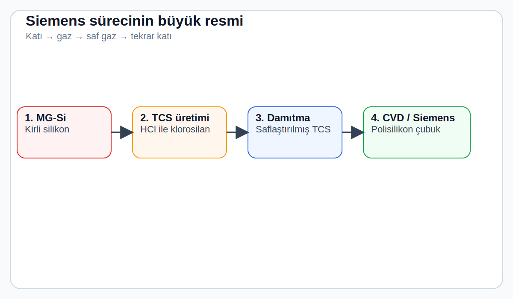
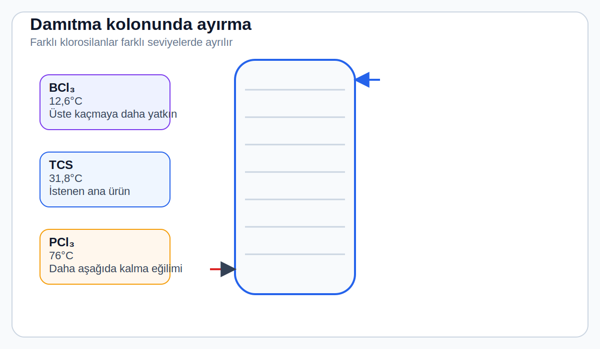
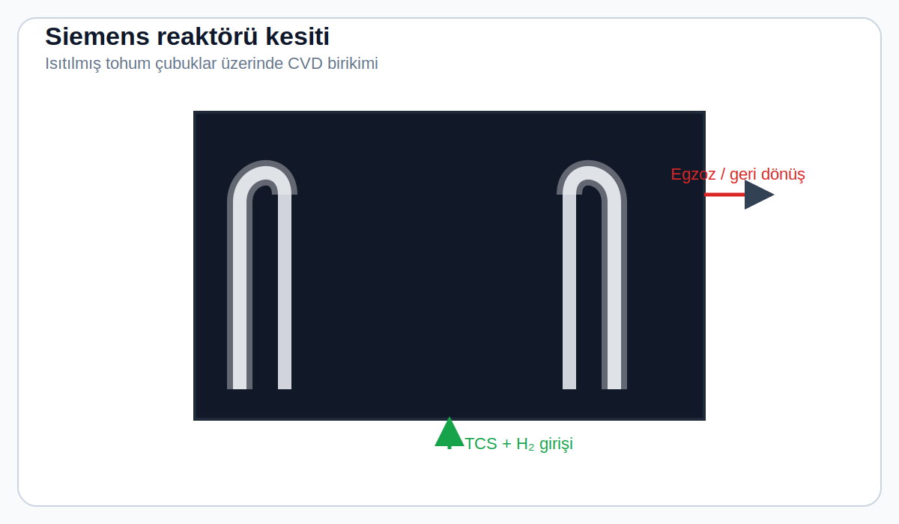
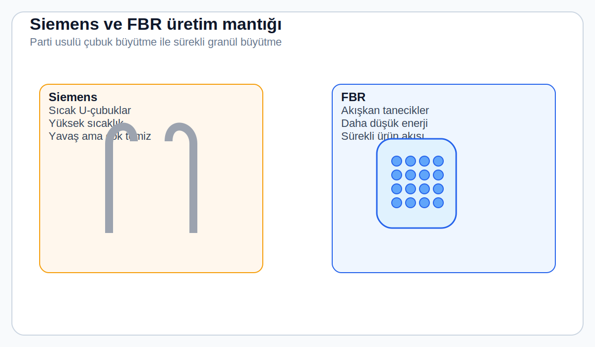

# 3. Gün: Siemens Süreci ve Polisilikon Saflaştırması

*Dün kumun metalürjik kalitede silikona dönüştüğünü gördük — %99 saf, ark ocaklarında 2.000°C'de eritildi. Etkileyici, ta ki kalan %1'lik safsızlığın bir güneş hücresini tamamen kullanılmaz kılacağını öğrenene kadar. Bugün tedarik zincirindeki en kritik ve en enerji yoğun adımı izliyoruz: O kirli metali, milyonda yalnızca tek bir atomun yabancı olacağı kadar saf polisilikon'a dönüştürmek.*

---

## Neden %99 Hiçbir İşe Yaramaz

Düşünce deneyi yapalım. Elinizde bir parça metalürjik kalite silikon (MG-Si) var. Kütlece %99'u silikon. Temiz gibi görünüyor, değil mi?

Hiç değil.

O %1'lik safsızlık içinde demir, alüminyum, kalsiyum, titanyum, bor, fosfor ve daha düzinelerce element var. Bir kilogramda yaklaşık 10 gram yabancı atom demek bu.

Sorun şu: 1. Gün'den hatırlayın, bir güneş hücresinde elektronların kristal içinde serbestçe hareket edebilmesi gerekiyor. Demir atomları **rekombinasyon merkezleri** oluşturur — fotonların oluşturduğu serbest elektronları metal kontaklara ulaşmadan önce yakalayan yapışkan tuzaklar gibi.

> ⚡ **Kritik rakam:** Milyar silikon atomu başına *tek bir* demir atomu, güneş hücresinin verimini **yarı yarıya** düşürebilir.

6\. Gün'de bilinçli olarak ekleyeceğimiz bor ve fosfor ise milyarda bir düzeyinde kontrol edilmeli. Eğer halihazırda milyonda bir seviyesinde kontrolsüzce mevcutlarsa, cihazın fiziği üzerindeki kontrolü kaybetmişsiniz demektir.

Dolayısıyla saflaştırma hedefi net: %99'dan (iki dokuz) **%99,9999'a** (altı dokuz) — dört büyüklük sırası iyileşme. Ve bunu, güneş panellerinin fosil yakıtlarla rekabet edebileceği kadar ucuza yapmamız gerekiyor.

> 🧭 **Bugünün ana fikri:**
> Siemens süreci bir "ekstra kalite" adımı değil; güneş hücresinin çalışabilmesi için gerekli atomik temizlik seviyesini sağlayan zorunlu geçittir.

---

## Çözüm: Katı → Gaz → Saf Gaz → Katı

70+ yıl önce endüstrinin bulduğu çözüm, konsept olarak zarif, uygulama olarak acımasızdır:

**Silikonu gaza dönüştür → gazı damıtarak saflaştır → tekrar katıya çevir.**

Bu, **Siemens süreci**dir ve dünya çapında güneş pillerinde kullanılan polisilikonun yaklaşık %95'i bu yöntemle üretilir.

*Şekil önerisi: Katı silikonun gaz fazına geçişi, kolonlarda saflaştırılması ve reaktörde tekrar katılaşması tek çizimde gösterilir.*

> 💡 **Neden gaz fazı?**
> Katı veya sıvı metalden tek tek atomları seçemezsiniz. Ama gazları damıtabilirsiniz — farklı kaynama noktalarından yararlanarak safsızlıkları ayırt edebilirsiniz. Bu, viski damıtmakla aynı temel prensiptir — sadece toleranslar milyon kat daha sıkıdır.

---

## Kısa Tarihçe

Siemens süreci 1950'lerde Alman Siemens AG tarafından geliştirildi — amaç güneş enerjisi değil, transistörler için ultra saf silikon üretmekti. Onlarca yıl boyunca yarı iletken endüstrisinin niş bir işlemiydi. 1990'da küresel polisilikon üretimi yılda yalnızca 20.000 tondu.

Sonra güneş enerjisi patladı. 2023'te üretim **1,5 milyon tonu** aştı — %95'ten fazlası fotovoltaik panellere gidiyor.

Bugün pazara hâkim olan şirketler: Tongwei, Daqo, Xinte ve GCL (Çin); Wacker Chemie (Almanya); OCI (Güney Kore); Hemlock Semiconductor (ABD). Çin, küresel üretimin yaklaşık **%90'ını** kontrol ediyor.

---

## Adım Adım: Metalden Gaza ve Geriye

### Adım 1: Triklorosilan Üretimi

Ezilmiş MG-Si, 300–350°C'de susuz HCl gazıyla tepkimeye sokulur:

**Si + 3HCl → HSiCl₃ + H₂**

Ürün **triklorosilan (TCS)**: Yalnızca 31,8°C'de kaynayan renksiz bir sıvı. Artık saflaştırma problemini kimya mühendisliğinin en güçlü silahının — **damıtmanın** — alanına taşımış olduk.

### Adım 2: Damıtma

TCS, 30–50 metre yüksekliğinde damıtma kolonlarına beslenir. Her kolonda buhar ve sıvı sürekli temas halindedir.

> 💡 **Acemi dostu okuma kuralı:**
> Bu aşamada olan şey çok basit: "benzer ama aynı olmayan" moleküller, farklı sıcaklıklarda ayrılıyor. Siemens sürecinin zekâsı burada — silikonu önce ayrıştırılabilir bir forma çevirmiş oluyoruz.

Farklı safsızlıkların klorosilan bileşikleri farklı kaynama noktalarına sahiptir:

| Bileşik | Kaynama Noktası |
|---------|----------------|
| Bor triklorür (BCl₃) | 12,6°C |
| Triklorosilan (TCS) | 31,8°C |
| Fosfor triklorür (PCl₃) | 76°C |

Bu farklar, sıcaklık ve basıncı dikkatlice kontrol ederek TCS'yi neredeyse tüm safsızlıklardan ayırmamıza olanak tanır. Birden fazla damıtma aşaması seri olarak kullanılır — ilk kolon ağır metalleri ayıklar, sonrakiler bor ve fosforu hedefler.

İyi çalışan bir damıtma dizisi, nihai TCS'de bor ve fosforu **milyarda 0,1 parçanın** altına indirebilir.

*Şekil önerisi: Kolon boyunca sıcaklık gradyenti ve üst/alt ürünlerde farklı bileşiklerin ayrılması.*

> 🎯 **Perspektif:** Bu, bir İskoç damıtıcısını ağlatacak hassasiyettedir. Su ve etanol ayırmıyoruz — kaynama noktaları birkaç derece farklı olan molekülleri ayırıyoruz ve milyarda atom sayısında ölçülen saflığa ulaşmamız gerekiyor.

### Adım 3: Siemens Reaktörü (CVD)

Sürecin kalbi ve adını veren adım budur. Siemens reaktörü, 2–3 metre çapında çan biçimli bir odadır. İçinde ultra saf silikondan yapılmış ince çubuklar ("tohum çubukları") ters U şeklinde monte edilir.

Elektrik akımı bu çubukları **1.050–1.150°C**'ye kadar ısıtır. Saflaştırılmış TCS buharı, hidrojen gazıyla birlikte reaktöre beslenir:

**HSiCl₃ + H₂ → Si + 3HCl**

Silikon atomları çubukların yüzeyinde katman katman birikir — kumun etrafında oluşan inci gibi. 5–7 gün içinde, başlangıçta 7–10 mm olan çubuklar **150–200 mm** çapa ulaşır. Bir reaktördeki toplam üretim: parti başına **5–10 ton** polisilikon.

*Şekil önerisi: U-biçimli tohum çubuklar, sıcak bölge, gaz girişi ve kalınlaşan polisilikon tabakası.*

> 💡 **Dönüşüm verimi kötü — ama sistematik:**
> Reaktöre giren TCS'nin yalnızca %10–15'i silikona dönüşür. Geri kalanı reaksiyona girmemiş TCS, SiCl₄ ve HCl olarak çıkar — ama bunların hepsi yakalanıp geri dönüştürülür. Modern Siemens tesisi neredeyse kapalı döngü bir kimyasal fabrika gibi çalışır.

<!-- 📊 [DİYAGRAM ÖNERİSİ: Siemens reaktörü kesit görünümü — tohum çubuklar, TCS+H₂ girişi, büyüyen polisilikon, egzoz gaz çıkışı. Etiketli.] -->

---

## Enerji Faturası

İşte rahatsız edici gerçek: 1.100°C'de parlayan o çubuklar **muazzam** elektrik tüketiyor.

- Tek bir Siemens reaktörü: **1–3 MW** sürekli, 5–7 gün boyunca
- Büyük bir polisilikon fabrikası (yüzlerce reaktör): **500+ MW** — küçük bir şehir kadar
- Toplam enerji: Siemens yöntemiyle **60–80 kWh/kg**

400 W'lık standart bir güneş panelinde yaklaşık 1,5 kg polisilikon var. Yani sadece polisilikon adımında **100–120 kWh** elektrik harcanıyor — paneldeki toplam gömülü enerjinin yaklaşık **%30–40'ı**.

> 🎯 **Bu yüzden polisilikon fabrikaları stratejiktir:**
> Ucuz ve temiz elektrik, burada yalnızca bir maliyet kalemi değil; küresel rekabet gücünü belirleyen temel değişkendir.

> ⚡ **Neden coğrafya bu kadar önemli:**
>
> | Elektrik fiyatı | Kg başına maliyet |
> |----------------|-------------------|
> | 0,04 $/kWh (Sincan, kömür) | ~2,80 $ |
> | 0,10 $/kWh (Avrupa sanayisi) | ~7,00 $ |
>
> Polisilikon 7–10 $/kg'a satılırken, **tek başına elektrik maliyeti** bir tesisin kârlı olup olmadığını belirler. Bu bir teknoloji yarışı değil, enerji yarışı.

---

## Rakip: Akışkan Yataklı Reaktörler (FBR)

Siemens yöntemi işe yarıyor ama enerji açlığı hep Aşil topuğu oldu. FBR teknolojisi farklı bir yaklaşım sunar:

*Şekil önerisi: Parti usulü sıcak çubuk büyütme ile akışkan yatakta sürekli granül büyütme yan yana.*

Silan gazı (SiH₄), küçük silikon tohum parçacıklarından oluşan bir yatağa beslenir. Gaz daha düşük sıcaklıkta (600–800°C) ayrışarak tohumların üzerine silikon biriktirir. Alttan üflenen sıcak gaz parçacıkları havada "yüzdürür" — akışkan halde tutar.

**Avantajları:**
- Enerji tüketimi: **25–35 kWh/kg** (Siemens'in yarısı)
- Sürekli çalışma (5–7 günlük döngü yok)
- Doğrudan kristal büyütme fırınlarına beslenebilen granül ürün

**Dezavantajları:**
- Küçük granüller büyük yüzey alanı = daha fazla yüzey kirliliği riski
- Hidrojen ve karbon safsızlıkları daha yüksek olabilir

GCL Technology (Çin) ve REC Silicon (ABD, Moses Lake) FBR'nin öncüleri. 2024'te GCL'nin küresel pazar payı yaklaşık **%25–30** — geri kalanı hâlâ Siemens yöntemiyle üretiliyor. Yavaş ama istikrarlı bir teknoloji geçişi yaşanıyor olabilir.

---

## Ürün: Polisilikon

Siemens reaktöründe 5–7 gün kaldıktan sonra güç kesilir, reaktör açılır ve gümüşi gri, olağanüstü saf U-şekilli devasa çubuklar ortaya çıkar.

Bu çubuklar **çok kristalli**dir — milyonlarca küçük kristal tanecik rastgele yönlerde bir araya gelmiştir. "Poli-silikon" adı buradan gelir (poli = çok).

Çubuklar kırılır, parçalar asit ve saf suyla yıkanır, sonra test edilir:

| Parametre | Spesifikasyon |
|-----------|--------------|
| Bor | < 0,3 ppba (milyar atom başına parça) |
| Fosfor | < 0,5 ppba |
| Demir | < 0,1 ppba |
| Toplam metaller | < 1 ppba |
| Karbon | < 0,5 ppma (milyon atom başına parça) |

Bu parçalar temiz polietilen torbalara paketlenir ve tedarik zincirinin bir sonraki durağına gönderilir: **kristal büyütme fırınları**. Orada bu rastgele yönlendirilmiş malzeme eritilecek ve tek bir mükemmel kristal halinde yeniden düzenlenecek — ama bu yarının hikâyesi.

---

## Çevre Tablosu

Dürüst bir polisilikon anlatımı çevresel boyutu atlayamaz.

**Kimyasal yoğunluk:** Süreçte hidroklorik asit, patlayıcı hidrojen gazı, zehirli ve yanıcı triklorosilan ve sorunlu bir yan ürün olan silikon tetraklorür (SiCl₄) kullanılır.

**Geçmişteki sorunlar:** 2005–2012 arasında bazı Çinli üreticiler SiCl₄'ü yasadışı olarak boşaltarak zehirli atık alanlar yarattı. 2008'de Washington Post, fabrikaların yakınında hiçbir şeyin yetişmediği alanları belgeledi.

**Bugünkü durum:** Modern tesisler neredeyse tüm SiCl₄'ü TCS'ye geri dönüştürüyor. Wacker Chemie %99,9 klor geri dönüşümü iddia ediyor.

**Karbon ayak izi:**

| Enerji kaynağı | CO₂ (kg/kg polisilikon) |
|----------------|------------------------|
| Kömür (Sincan) | 50–70 |
| Hidroelektrik (Wacker, Sichuan) | 15–25 |

> 🌿 **Panel ömrü boyunca çok daha fazla CO₂'yi dengeler — ama "kimin kömürüyle" doğduğu sorusu, AB ve ABD'de tarifeleri ve tedarik zinciri izlenebilirlik gerekliliklerini yönlendiren ciddi bir ticaret politikası meselesine dönüştü.**

---

## Büyük Resim

Çoğu insanı şaşırtan gerçek: **Güneş paneli yapımında en pahalı ve en enerji yoğun adım, sofistike yarı iletken işleme veya hassas dilimlemek değil — ham maddenin saflaştırılmasıdır.**

Siemens süreci özünde kaba kuvvet çözümüdür: Aşırı sıcaklıklara ısıtıyoruz, katı-gaz arasında iki kez geçiş yapıyoruz, devasa damıtma kuleleri çalıştırıyoruz ve şehir ölçeğinde elektrik harcıyoruz — hepsi milyonda birkaç parça yanlış atomu temizlemek için.

Ve yine de işe yarıyor. Ölçekte çalışıyor, güvenilir çalışıyor. Son 20 yıldaki aralıksız optimizasyon, polisilikon maliyetini 2008'deki 400+ $/kg'dan bugünkü <10 $/kg'a indirdi — **%97'lik** bir düşüş. Bu, güneş enerjisinin artık dünyanın çoğu yerinde en ucuz yeni enerji kaynağı olmasının ana nedenlerinden biri.

Yarın, bu ultra saf parçaları kristal büyütme fırınına kadar takip edeceğiz — **Czochralski süreci**, kaotik çok kristalli kütleyi tek bir mükemmel kristale dönüştürecek. Malzeme biliminin simyaya benzemeye başladığı yer burası.

---

## 🧪 Anlayışınızı Test Edin

{{#quiz quizzes/day-03.toml}}
