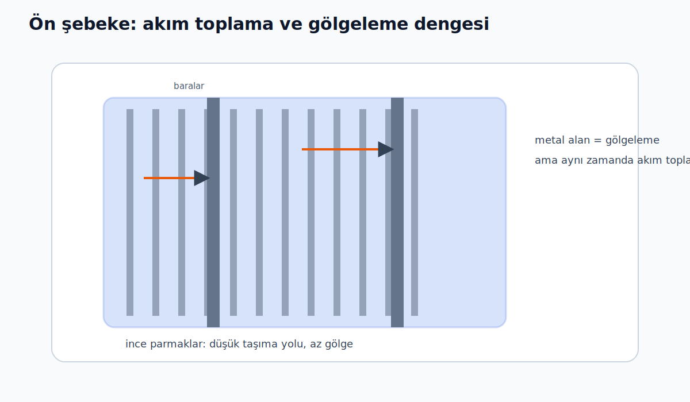
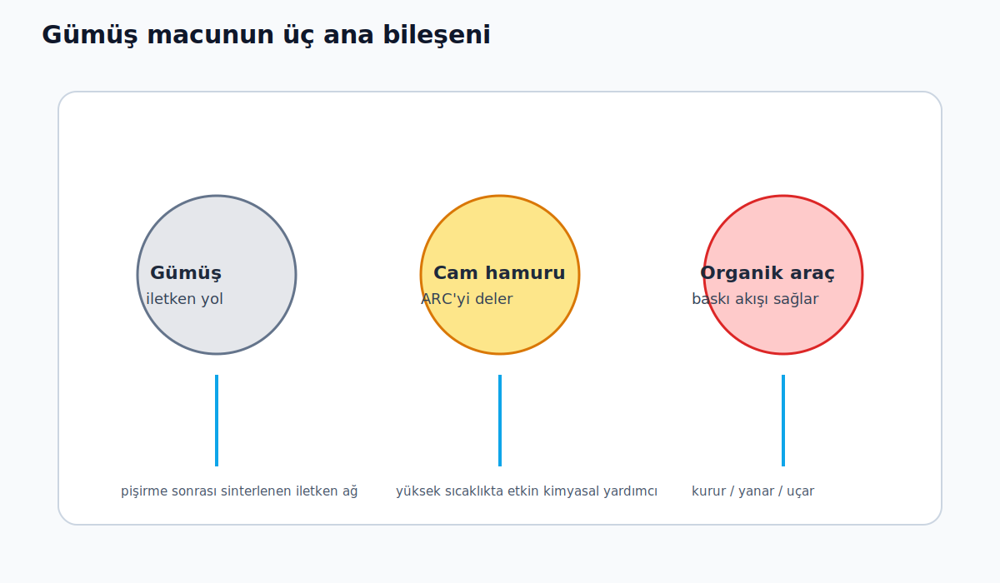
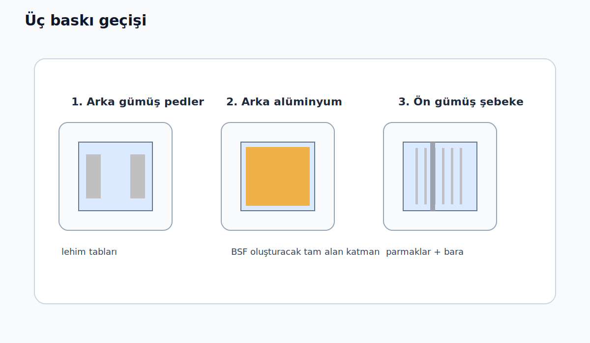
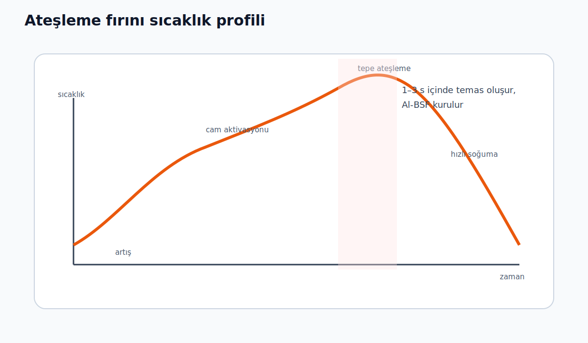

# 8. Gün: Serigrafi ve Metalizasyon — Güneşi Kablolamak

*Yedi günlük saflaştırma, kristal büyütme, dilimleme, doplama ve kaplamanın ardından, gelen güneş ışığının %97'sini emebilen ve yük taşıyıcılarını acımasız verimlilikle ayırabilen bir levhaya sahipsiniz. Tek sorun: Serbest kalan elektronların gidecek hiçbir yeri yok. Metal kontaklar olmadan, tüm bu mühendislik harikası sıcak, koyu mavi bir dilimden ibaret kalır. Bugün hücreyi kabloluyoruz — ve endüstrinin seçtiği yöntem büyük ihtimalle tişört baskısından tanıyacağınız bir teknik.*

---

## 5 Milyar Dolarlık Darboğaz

Metalleştirme, fiziğin ekonomiyle en sert şekilde buluştuğu yer. Ön temas noktaları iki çelişkili talebi karşılamalı:

1. **Elektriksel mükemmel:** Düşük direnç, silikonla yakın temas
2. **Fiziksel görünmez:** Gelen ışığı engellemeyen ince çizgiler

Her milimetrekare metal = elektrik üretemeyen bir milimetrekare alan. Buna **gölgeleme kaybı** denir — tipik olarak hücre alanının %2–4'ü.

> 📌 **Başlangıç sezgisi:** Ön yüzdeki metal çizgiler bir tür "kayıp" gibi görünür. Ama hiç metal olmazsa üretilen akımı dışarı çıkaramazsınız. Bu adımın bütün mantığı, **olabildiğince az gölgeyle olabildiğince iyi akım toplamak**.

Bu iğneye iplik geçiren malzeme **gümüş** — özel formülasyonlu macunu kg başına 800–1.200 $. 2024'te fotovoltaik endüstrisi **7.000+ ton** gümüş tüketerek, tüm endüstriler arasında en büyük gümüş tüketicisi oldu. Yıllık gümüş macunu maliyeti: **5+ milyar $**.

> ⚡ **Neden gümüş?** Tüm elementler arasında en düşük elektrik direncine sahip (1,59 × 10⁻⁸ Ω·m). Bakır yakın (1,68 × 10⁻⁸) ama silikona yayılarak hücreyi yok ediyor. Gümüşün yerini almak kolay değil.

*Şema/TODO: İnce parmakların akımı toplarken aynı anda ışığı da kısmen gölgelediğini gösteren basit hücre üst görünüşü.*

---

## Gümüş Macunun Anatomisi

Gümüş macunu sadece metal tozu + tutkal değil. Hassas mühendislik ürünü üç bileşenli bir sistem:

| Bileşen | Oran | İşlev |
|---------|------|-------|
| **Gümüş parçacıkları** | %65–85 | İletkenlik |
| **Cam hamuru** | %2–10 | ARC'yi eritip silikon temasını sağlama |
| **Organik araç** | %15–30 | Basılabilirlik + pişirmede yanarak kaybolma |

> 💡 **Cam hamuru — gizli silah:**
> Pişirme sırasında (~600°C) camın içindeki kurşun oksit (PbO), dün özenle kapladığımız SiNₓ yansıma önleyici kaplamayı *eritir*. Bu kimyasal saldırı olmasa gümüş silikonla hiç temas etmez. Cam hamuruyu "yalnızca yüksek sıcaklıkta, tam zamanında aktive olan bir asit" olarak düşünün.

> 🧠 **Bunu nasıl hayal etmeli?** Macun fırına girmeden önce yalnızca yüzeye oturur. Fırından sonra ise kaplamayı delmiş, silikona bağlanmış ve iletken bir yol oluşturmuş olur. Yani gerçek "elektriksel temas" baskı anında değil, **ateşleme sırasında** doğar.

Büyük macun üreticileri (Heraeus, DuPont, Samsung SDI, Giga Solar) formülasyonlarını devlet sırrı gibi korur. Cam hamuru bileşimindeki %1'lik fark, hücre veriminde %0,3'lük salınım demek — gigawatt fabrikasında milyonlarca dolar.

*Şema/TODO: Gümüş parçacıkları, cam hamuru ve organik aracın baskı öncesi ve pişirme sonrası rollerini gösteren katman diyagramı.*

---

## Baskı: Üç Geçiş, Üç Macun

Standart bir güneş hücresi **üç ayrı serigrafi geçişi** alır — saatte 4.000–6.000 levha hızında (saniyede yaklaşık bir levha).

### Geçiş 1: Arka Gümüş (Lehim Pedleri)
Hücrenin arkasına küçük gümüş pedler basılır — modülde hücreleri birbirine bağlayacak lehimleme noktaları.

### Geçiş 2: Arka Alüminyum (Tam Alan)
Arka yüzeyin neredeyse tamamına alüminyum macun basılır (~30–50 $/kg, gümüşün kırkta biri). Pişirme sırasında alüminyum silikonla alaşımlanarak p⁺ katkılı **arka yüzey alanı (BSF)** oluşturur — elektronları içe doğru geri iten bir "ayna." BSF olmasaydı verimlilik ~%2–3 düşerdi.

### Geçiş 3: Ön Gümüş (Parmaklar ve Baralar)
**Kritik adım.** İnce paralel "parmaklar" (akım toplayan) ve bunları birleştiren dikey "baralar" — güneş paneline yakından baktığınızda gördüğünüz çizgiler.

*Şema/TODO: Arka gümüş pedler → arka alüminyum tam alan → ön gümüş parmaklar sıralamasını gösteren akış diyagramı.*

---

## Ekran Yazıcısının İçi

Makine kavramsal olarak basit, mekanik olarak müthiş hassas:

**Ekran/Şablon:** Paslanmaz çelik ağ veya lazerle kesilmiş folyo (25–30 μm kalınlık). Yalnızca gümüş olacak yerlerde açıklıklar var. Modern parmak açıklıkları **20–30 μm** genişliğinde.

**Silecek:** Poliüretan veya çelik bıçak, 200–400 mm/s hızla elek boyunca kayarak macunu açıklıklardan levhaya zorlar.

**Hizalama:** Makine görüşü ile ±10 μm doğruluk.

**Döngü süresi:** Yükleme → hizalama → baskı → boşaltma: levha başına **~1,2–1,8 saniye**.

> 🎯 **Şablon mu yoksa ağ mı?** En yüksek çözünürlük için artık çoğu fabrika **şablona** (sert metal folyo, lazerle kesilmiş) geçti. Ağ eleklerin aksine macun akışını bozan tel birleşim noktaları yok — 20 μm altı parmak genişliklerini mümkün kılıyor.

---

## Pişirme Fırını: 60 Saniyede Kimya

Baskıdan sonra levhalar 6–10 metre uzunluğundaki kızılötesi **ateşleme fırınından** geçer. Toplam süre: 30–60 saniye. Ama bu kısa sürede dört kritik olay gerçekleşir:

| Aşama | Sıcaklık | Süre | Olan |
|-------|---------|------|------|
| Artış | 200–400°C | ~15 s | Organik araç yanar ve uçar |
| Cam aktivasyonu | 500–650°C | ~10 s | Cam hamuru SiNₓ kaplamayı eritir, gümüş silikon yüzeyine ulaşır |
| **Tepe ateşleme** | **750–850°C** | **1–3 s** | Gümüş kristalitler silikonla temas kurar; arka alüminyum BSF oluşur |
| Hızlı soğuma | 800→400°C | ~10 s | Yapı dondurulur |

> ⚡ **En kritik parametre:** Tepe sıcaklığı ±5°C → verimlilik ±%0,1–0,2. Saniyelerle ölçülen bu pencere, tüm süreçteki en hassas an.

> 🔬 **Yeni başlayanlar için kritik nokta:** Fırın burada sadece "kurutma" yapmaz. Aynı anda kaplamayı deler, metal-silikon temasını oluşturur ve arka tarafta BSF meydana getirir. Yani bu adım, malzemeyi gerçekten **çalışan hücreye** dönüştürür.

*Şema/TODO: Zaman ekseninde ramp-up, cam aktivasyonu, tepe ateşleme ve hızlı soğuma bölgelerini gösteren profil.*

Fırından çıkan şey **tamamlanmış bir güneş hücresi.** Tek termal çekimde üç sorun çözüldü: gümüş ARC'yi deldi, silikonla ohmik temas kurdu, alüminyum BSF oluşturdu. Bu "ortak ateşleme" güneş enerjisi üretimindeki en zarif adımlardan biri.

---

## Geometri Savaşı

Metalleştirme deseni klasik mühendislik optimizasyonu:

- **Daha geniş parmaklar** → düşük direnç ama daha fazla gölgeleme
- **Daha dar parmaklar** → az gölge ama yüksek direnç

| Yıl | Bara sayısı | Parmak genişliği | Gölgeleme |
|-----|------------|-----------------|-----------|
| 2015 | 5 | ~50 μm | ~%3,5 |
| 2025 | 12–16 (MBB) | 25–30 μm | **<%2,5** |

Bu evrim tek başına ~%0,5 mutlak verimlilik artışına katkıda bulundu — daha iyi baskı ve daha akıllı geometriden.

---

## Gümüş Krizi

İşte güneş enerjisi yöneticilerini uykusuz bırakan gerçek:

2024'te:
- Bir TOPCon hücresi **~90–95 mg/W** gümüş tüketiyor
- PV sektörü toplam **~7.000+ ton** gümüş kullandı — küresel madencilik üretiminin **~%20'si**
- 2030'a kadar yılda 1,5–2 TW kurulum hedefinde, tek başına PV talebi toplam gümüş arzını aşabilir

**Çözüm yolları:**

| Strateji | Durum |
|----------|-------|
| Daha ince baskı | 200 mg/W (2010) → 80–85 mg/W (2025) |
| Bakır değişimi | HJT hücrelerinde umut vaat ediyor — a-Si doğal difüzyon bariyeri |
| Gümüş-bakır alaşımları | Gümüşü %30–50 azaltma |
| Elektrokaplama | Serigrafiyi tamamen atlıyor, 5–10 μm çizgiler mümkün |

> 💡 **Bakırın sorunu nedir?** Oda sıcaklığında bile silikona hızla yayılarak rekombinasyon merkezleri yaratır. Her bakır metalizasyon şeması bir difüzyon bariyeri (nikel veya tungsten) gerektirir — bu da ek karmaşıklık ve maliyet demek.

---

## Bu Adım Neden Önemli?

Baskıdan önce: ışığa duyarlı bir yarı iletkeniniz var.
Baskı + ateşleme sonrası: bir kabloya bağlayıp güç alabileceğiniz bir **cihaz.**

Serigrafi baskı konsept olarak saçma derecede basit — macunu desenli elekten lastik bıçakla itin. Ama TW ölçeğinde, saniyede bir levha hızında, 25 μm genişliğinde, yılda milyarlarca hücre yaparak çalıştırmak — bu onlarca yıllık artımlı mühendisliğin kanıtı.

Yarın büyük resme bakacağız: **hücre mimarileri.** PERC, TOPCon, HJT — arka yüzeyden temas yapısına kadar her şeyi yeniden düşünen tasarımlar. Her mimari farklı macunlar, farklı baskı desenleri, farklı pişirme profilleri gerektirir — ve özellikle gümüş tüketimindeki fark, sektörü yeniden şekillendiriyor.

---

## 🧪 Anlayışınızı Test Edin

{{#quiz quizzes/day-08.toml}}
